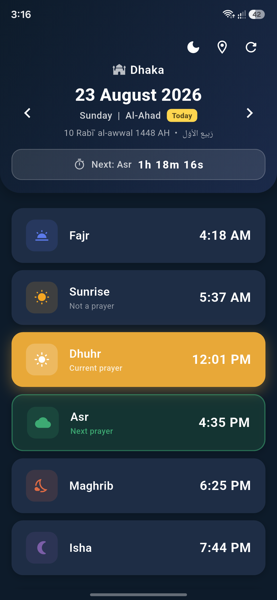
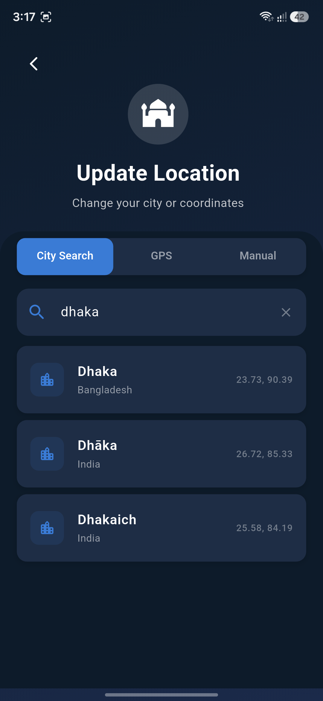

<div align="center">

<a src="https://github.com/wizsk/salah-times/releases/latest"></a>

# Salah Times

[](https://github.com/wizsk/arabic_lexicons/releases/latest)
[](https://github.com/wizsk/arabic_lexicons/releases)

### A libre Salah Times app

[](https://github.com/wizsk/salah-times/releases/latest/)

#### Salah Times will help you see salah times that's it

[](assets/showcase/0.png)
[](assets/showcase/1.png)
</div>

## Verify

Certificates Hash

```
SHA-256: 324fc0e3f874d505e7130846cd2c8b03de78a0ec22e0362c11324bada54c3c77
SHA-1: 7bfafacbccbb383f219bf2c4aed819882a73eee8
```

## Build or run

```sh
git clone https://github.com/wizsk/salah-times.git
cd salah-times
flutter pub get
flutter run # flutter build apk
```

## License

This project is fully open source and released under the **GPL-3.0 License**.
